# Duck Pond DND Dice Roller 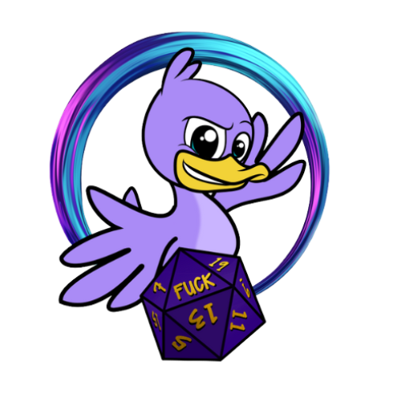

**Developer: James Hart**

[Live website](https://jameshart197.github.io/CI_PP2_DiceRoller/)

## Table of Content

  - [Project Goals](#project-goals)
    - [User Goals](#user-goals)
    - [Site Owner Goals](#site-owner-goals)
  - [User Experience](#user-experience)
    - [Target Audience](#target-audience)
    - [User Requirements and Expectations](#user-requirements-and-expectations)
    - [User Stories](#user-stories)
  - [Design](#design)
    - [Colour](#colour)
    - [Fonts](#fonts)
    - [Structure](#structure)
    - [Wireframes](#wireframes)
  - [Technologies Used](#technologies-used)
    - [Languages](#languages)
    - [Frameworks, Libraries & Tools](#frameworks-libraries--tools)
  - [Features](#features)
  - [Validation](#validation)
    - [HTML Validation](#html-validation)
    - [CSS Validation](#css-validation)
  - [Testing](#testing)
    - [Accessibility](#accessibility)
    - [Performance](#performance)
    - [Performing tests on various devices](#performing-tests-on-various-devices)
    - [Browser compatability](#browser-compatability)
    - [Testing user stories](#testing-user-stories)
  - [Bugs](#bugs)
  - [Deployment](#deployment)
  - [Credits](#credits)
  - [Acknowledgements](#acknowledgements)

## Project Goals

### User Goals

- To be able to roll a single dice and see the outcome
- To be able to roll multiple of the same dice and see the outcome of each and the combined result
- To be able to roll different types of dice and see the outcome of each and the combined result
- To be able to apply “standard critical hit” rules via one click and have double the number of each dice selected rolled 
- To be able to apply “dangerous critical hit” rules via one click and have the correct number added to each roll
- To be able to apply a modifier and have that modifier be applied to the overall result of your rolls
- To provide visual representation of the random elements of rolling and display the results visually
- To provide links to the social media sites of the Duck Pond
- To keep a record of previous rolls on the screen until the user wishes to clear it

### Site Owner Goals

- To provide a clean and efficient dice rolling system for players
- To provide a self-explanatory rolling system to prevent large amounts of explanation being required
- To give users a positive experience via clear and usable elements on the site so they return to the site
- To provide links to various social media sites to generate interest on those mediums

## User Experience

### Target Audience

- Dungeons and Dragons players already in the Duck Pond Community
- New D&D players who want to understand criticals and the different types
- Various D&D players who want to get quick dice results in a clear, self-explanatory way

### User Requirements and Expectations

- Easy to understand functionality
- Clear and concise information
- Results immediately available on the screen
- All links take you where you would expect to go
- All links open in a new tab
- Site feels responsive and accessible on all platforms
- Intuitive usage of the various elements of the site
- A record of past rolls until cleared
- A visual representation of the rolling system
- Visually appealing site
- Good performance on the site

### User Stories

1. As a first time user, I want to be able to roll a single d20
2. As a first time user, I want to be able to roll multiple of a single dice
3. As a first time user, I want to be able to roll various different dice
4. As a first time user, I want to be able to roll a standard critical hit
5. As a first time user, I want to be able to roll a dangerous critical hit
6. As a first time user, I want to add a modifier and see that represented
   
#### Returning visitor
 
7. As a returning user, I want to find links to the social media of the Duck Pond
8. As a returning user, I want to see my past rolls this session
9. As a returning user, I want to purchase Duck Pond merchandise
10. As a returning user, I want to use this on my mobile
 

#### Site Owner
 
11.	As the site owner, I want the user to understand the site intuitively
12.	As the site owner, I want the user to be able to see their dice results clearly
13.	As the site owner, I want the user to be able to maintain their modifier from roll to roll

## Design

### Colour

For the colour scheme I chose to go with black, white and purple as it matches the duck pond logo and theme. Important information is displayed in red. I also feel that these colours provide a professional looking site that is easy to read. When clear contrast was needed, I used blue and cyan to stand out easily from the page. 

 Colour Palette
 

### Fonts

I used the sans-serif throughout the site as I feel that it is incredibly clear and something that many users will be used to. I do not feel that the font was particularly important in terms of style as much as it was important that the information was clear to read. 

### Structure

The site is structured in a manner that is at once both clear to understand and intuitive for the user to navigate. This was achieved by clear indicators on various elements, a clean interface with very little clutter and simple colours. All external links open in a new tab and are recognizable as links by use of the FontAwesome icons for those sites. 
The site is only a single page, intended to be added to a larger website in the future.

### Wireframes

Unfortunately during the course of this project the Wireframe files were lost. Due to time constraints I have chosen not to recreate them after the project was finished just for the sake of including them in the Readme. The wireframes were made with Balsamiq and the key difference between them and the final project was in the mobile wireframes I initially did not have an "action panel" in the bottom of the screen because I had not considered that you cannot right click on mobile/tablet. When I realised this, I needed to make adjustments to the site, and created an action panel with modifying buttons. 

## Technologies Used

### Languages

- HTML
- CSS
- JavaScript

### Frameworks, Libraries & Tools

- [Adobe Color](https://color.adobe.com/) was used to create the colour scheme mock-up you can see in this README.md file.
- [Am I Responsive](http://ami.responsivedesign.is/) was used to create the multi-device mock-up you can see at the start of this README.md file.
- [Am I Responsive](http://ami.responsivedesign.is/) was used to test the responsiveness of the website.
- [Balsamiq](https://balsamiq.com/) was used to create the wireframes for the project.
- [Canva](https://www.canva.com/en_gb/) was used to create the logo for the site.
- [Favicon.io](https://favicon.io/) was used to make the favicon for the website. 
- [Font Awesome](https://fontawesome.com/) was used to create recognisable icons throughout the site.
- [Git](https://git-scm.com/) was used for version control, pushing the code to Github.
- [GitHub](https://github.com/) was used for remote storage of the repository for the project code.
- [Google Fonts](https://fonts.google.com/) were used to create the desired styling of text.
- [Greenshot](https://getgreenshot.org/) was used to create the screenshots in this README.md
- [WC3 Validator](https://validator.w3.org/) was used to test the HTML code for the website.
- [Jigsaw W3 Validator](https://jigsaw.w3.org/css-validator/) was used to test the CSS code for the website. 
- [Wave Validator](https://wave.webaim.org/) was used to test the accessibility of the website. 
- [Lighthouse](https://developers.google.com/web/tools/lighthouse/) was used to test the performance of the website. 

## Features

The website consists of a header, footer and a single page 

### Header 

- Contains Logo
- Contains Title

### Footer

- Contains Social Media Links and Merchandise Links

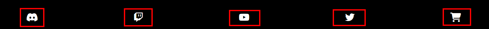

## Main Page

### Dice Container

- A clean white background with images of each dice. 
- Has the highest number on the dice in view to tell you which dice is which
- In mobile the dice move when selected so you know which die you are modifying

### Critical Hit Toggling Slide Buttons

- Clear colouring tell you when these are active
- Toggling one on toggles the other off
- Clearly labelled in mobile and desktop

### Modifier Section with +/- keys

- Simplistic format is easy to read
- Can be positive or negative
- Carries over to the next roll

### Roll Button

- Clear purpose
- Shows when hovered and clicked

### Animation Area

- Fills with relevant number of dice rolled
- Animates with number randomization
- Ends on dice result
- Has a scroll overflow

### Results Text Box

- Clear and easy to read
- Has a scroll overflow
- Indicates which criticals are rolled and shows the mathematics involved in achieving final results

### Clear Button

- Obvious, simple and out of the way
- Clears whole text area

## Validation

### HTML Validation

The W3C Markup Validation Service was used to validate the HTML of the website. 

HTML Validation

### CSS Validation

The W3C Jigsaw CSS Validation Service was used to validate the CSS of the website. 

CSS Validation

## Testing

### Accessibility

The WAVE WebAIM web accessibility evaluation tool was used to ensure the website met high accessibility standards. A warning is provided for an unlabelled form element, despite the presence of a label on the modifiers-desktop container. I was unable to rectify this error in the time available. There is also a contrast issue raised with the Roll button and its relevant text but I felt that the purpose of the button was clear even if the text was not present and thus chose to maintain the style. 

Wave Evaluation Summary

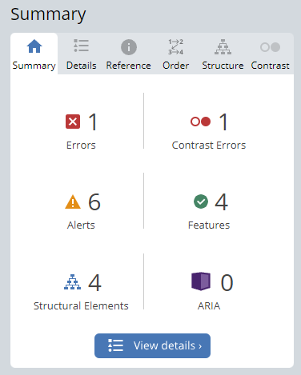

### Performance

Google Lighthouse in Google Chrome Developer Tools was used to test the performance of the website. The site is a little below the expected standard on mobile due to the presence of many images, some of which are not optimized for mobile. I chose to keep the images as they are at the cost of a small performance hit on mobile. The same warning that was present on the WAVE test is present for the Lighthouse test and remains unresolved (unlabelled form element).

Lighthouse Evaluation

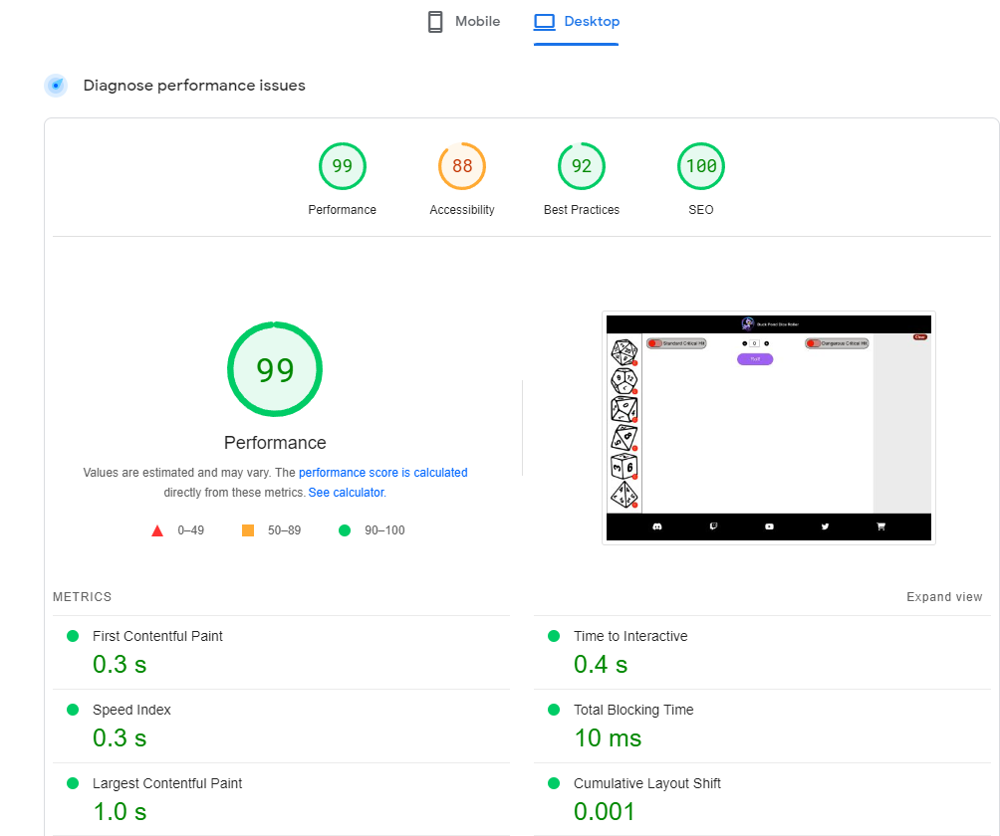
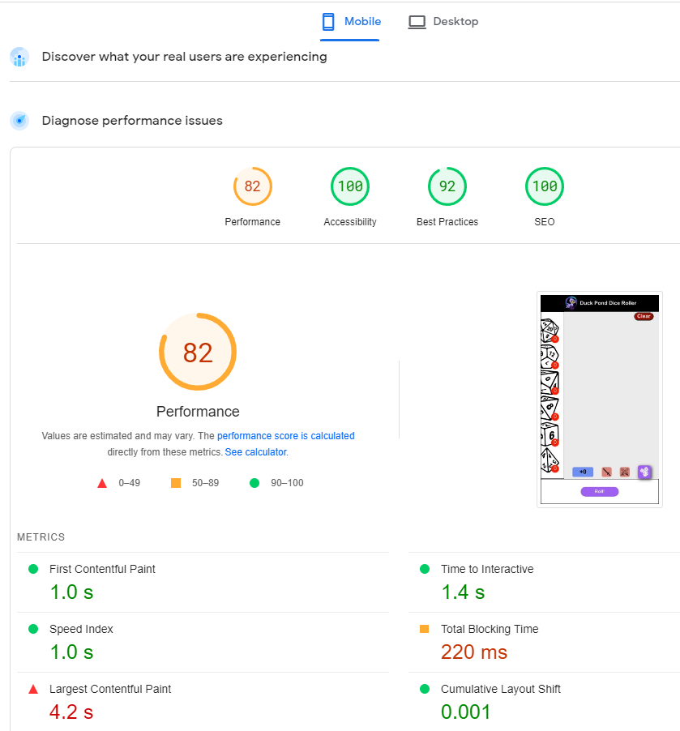

### Performing tests on various devices

The website was tested using Google Chrome Developer Tools Toggle Device Toolbar to simulate viewports of different devices.
The website was also tested manually on the following devices:

- 26 inch Desktop Monitor
- Lenovo v15 ada (laptop screen size)
- iPad Air 4th Gen (tablet screen size)
- iPhone 11 and Samsung Galaxy S21 (mobile screen size)
- Galaxy Fold (unusual screen dimensions)

### Browser compatability

The website was tested on the following browsers:
- Google Chrome
- Mozilla Firefox
- Opera
- Safari

### Testing user stories

1. As a first time user I want to be able to roll a single d20

- Select the D20 with left click on the relevant dice
- Click Roll Button
- See Results

Screen Capture

2. As a first time user, I want to be able to roll multiple of a single dice

- Select the dice with left click on the relevant dice
- Repeat click until correct number of chosen dice is displayed
- Click Roll Button
- See Results

Screen Capture

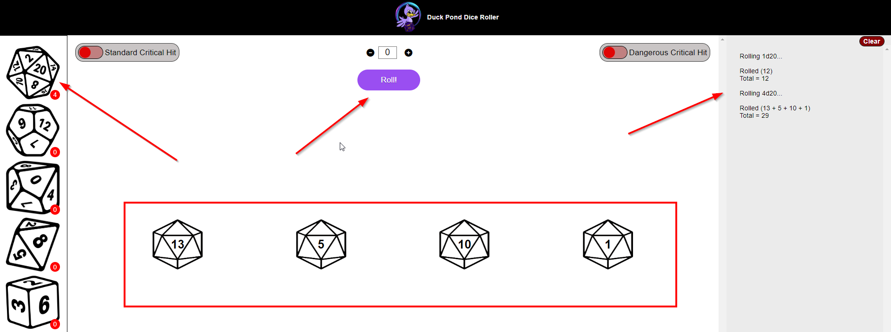

3. As a first time user, I want to be able to roll various different dice

- Select each chosen dice with left click on the relevant dice
- Click Roll Button
- See Results

Screen Capture

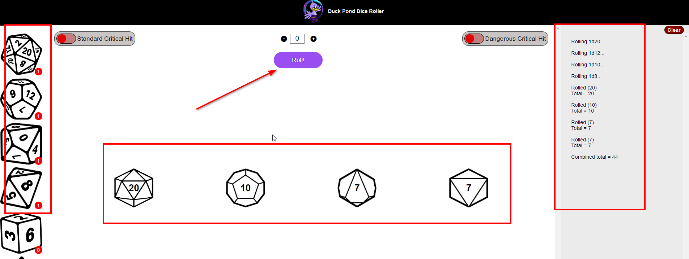

4. As a first time user, I want to be able to roll a standard critical hit

- Select the dice with left click on the relevant dice
- Toggle on the "Standard Critical Hit" button
- Click Roll Button
- An extra dice is rolled for each dice selected as per standard critical hit rules
- See Results

Screen Capture

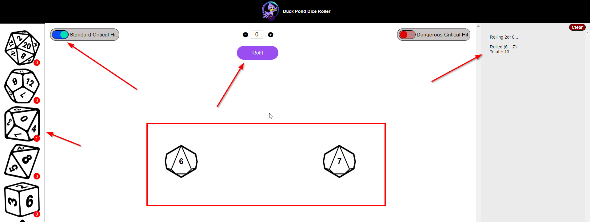

5. As a first time user, I want to be able to roll a dangerous critical hit

- Select the dice with left click on the relevant dice
- Toggle on the "Dangerous Critical Hit" button
- Click Roll Button
- See Results
- The maximum possible of each dice chosen is added to the total and mentioned as "Dangerous Crits" within the results

Screen Capture

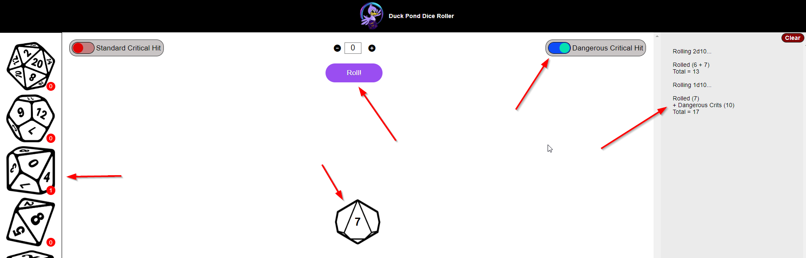

6. As a first time user, I want to add a modifier and see that represented

- Select the chosen dice with left click on the relevant dice
- Use the +/- keys to set the modifier
- Click Roll Button
- See Results
- See the modifier added in the results

Screen Capture

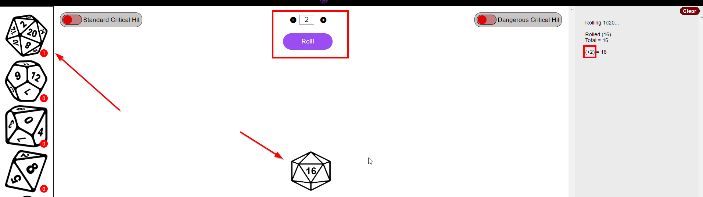

7. As a returning user, I want to find links to the social media of the Duck Pond

- See the images representing social media in the footer
- These images display what they are on hover (using titles)
- Click relevant social media link
- It opens in a new tab

Screen Capture

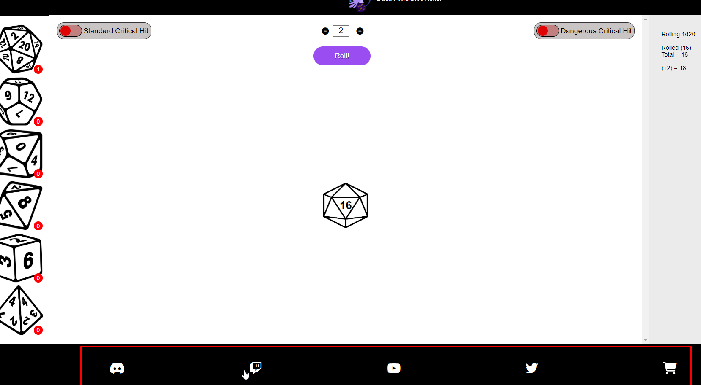

8. As a returning user, I want to see my past rolls this session

- Make rolls
- See the past rolls and results in the results-box to the right
- Overflow is displayed in scroll format

Screen Capture

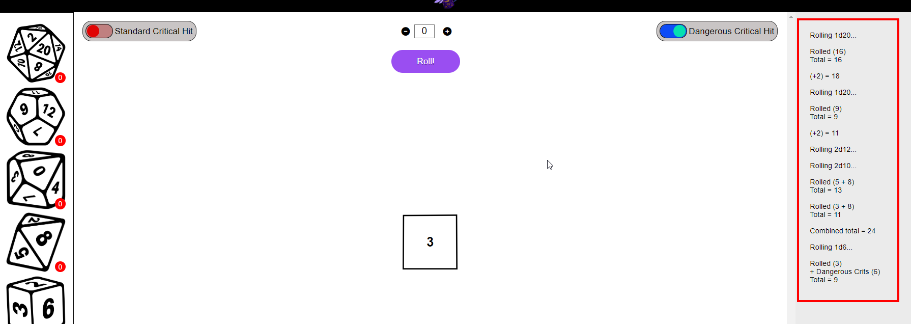

9. As a returning user, I want to purchase Duck Pond merchandise

- See "shopping cart" icon in footer
- Displays "Merchandise" tag on hover
- Clicking opens in a new tab

Screen Capture

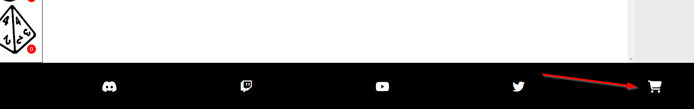

10. As a returning user, I want to use this on my mobile

- Site is navigable in mobile format
- Interactive action panel available for ease of use
- Simplistic design and navigation at bottom of page allows for speed of usage

Screen Capture

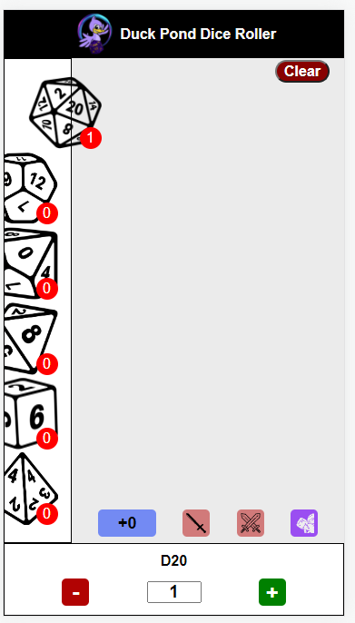

11. As the site owner, I want the user to understand the site intuitively

- All interactive elements have pointer hovers
- Purpose of each button is clear and obvious
- Site gives feedback such as hover queues and counter markers
- On/Off switches are clear to see and understand

Screen Capture

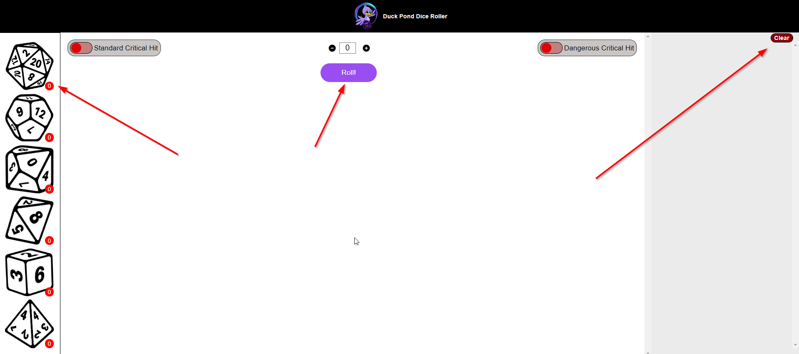

12. As the site owner, I want the user to be able to see their dice results clearly

- Results box is clear and easy to read
- Results of each roll are clearly explained
- Results include the calculations used to achieve result
- Dice in the animations area displays result on the rolled dice

Screen Capture

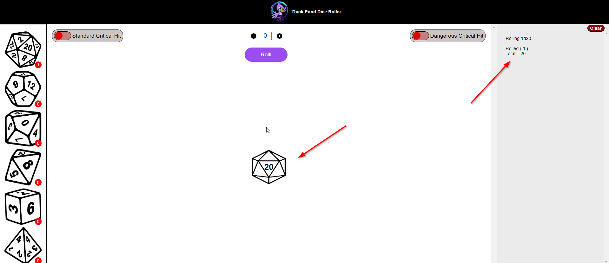

13. As the site owner, I want the user to be able to maintain their modifier from roll to roll

- When a modifier is selected it stays until changed
- This is displayed with the modifier showing in each roll in the results-box

Screen Capture

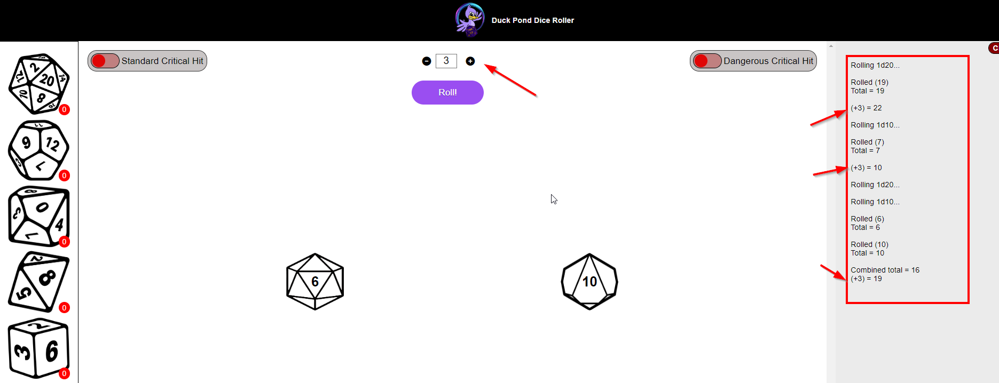

## Bugs

| Bug                                                                                                               | Fix                                                                                                                                       |
| ----------------------------------------------------------------------------------------------------------------- | ----------------------------------------------------------------------------------------------------------------------------------------- |
| Incremental Counter was going below 0  | Created ‘if’ statement for if the number is NOT 0 to execute the code. |
| Right Clicking the image was bringing up a context-menu | Found solution through stackoverflow for preventing default on right click within an HTML element |
| User cannot right click in mobile format | Implemented up and down buttons in the user-action-panel for mobile |                                                               |
| Clear button was being overwritten by text | Set a top margin in the results-box area. |
| Numbers were not adding correctly, but instead concatenating the strings produced | Coerced all numbers rolled to be viewed as numbers as opposed to strings |

## Deployment

### GitHub Pages
The website was deployed using GitHub Pages by following these steps:
1. In the GitHub repository navigate to the Settings tab
2. On the left hand menu select Pages
3. For the source select Branch: main
4. Once saved, GitHub will refresh and your website will be publishd from GitHub repository
5. The link to your published website will appear: "Your site is published at https://jameshart197.github.io/CI_PP2_DiceRoller/"

### Forking the GitHub Repository
1. Go to the GitHub repository
2. Click on Fork button in top right corner

### Making a Local Clone
1. Go to the GitHub repository 
2. Locate the Code button above the list of files and click it
3. Highlight the "HTTPS" button to clone with HTTPS and copy the link
4. Open Git Bash
5. Change the current working directory to the one where you want the cloned directory
6. Type git clone and paste the URL from the clipboard ($ git clone https://github.com/YOUR-USERNAME/YOUR-REPOSITORY)
7. Press Enter to create your local clone

## Credits

### Images

- [Logo](assets/images/no-text-logo.png): Created on [Canva](https://www.canva.com/en_gb/) by myself.
- Icons: Icons used throughout the site were taken from [FontAwesome](https://fontawesome.com/)
- Dice Models: Purchased on Etsy as vectors

### Code

-  Prevention of context menu on right click lifted from Stack Overflow
-  Guidance on modules for javascript files from Stack Overflow
-  Button design assisted by videos from WebDevSimplified

## Acknowledgements

This website was assisted in its production by;

- My mentor for professional guidance and feedback
- Readme contents guided by mentor and prior students
- Friends who tested the website and user stories for me on various devices 